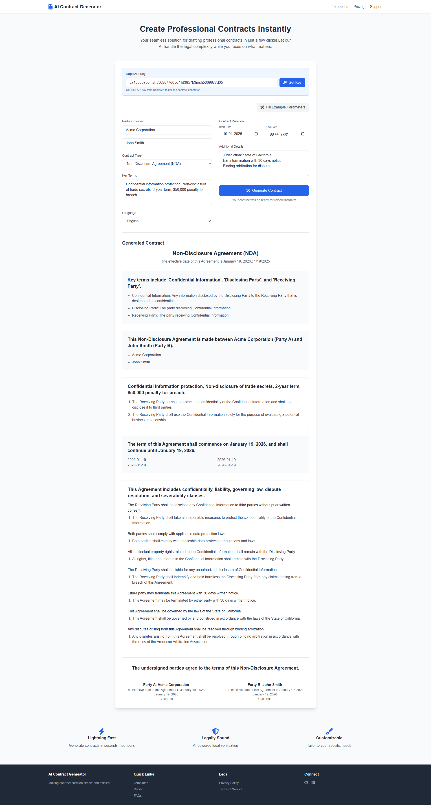

# AI Contract Generator



## Overview

AI Contract Generator is a powerful web-based tool that creates professional legal documents instantly using artificial intelligence. The application supports multiple languages and can generate various types of contracts including NDAs, employment contracts, service agreements, and more.

## Features

- **Multiple Contract Types**
  - Privacy & Data Protection Agreements (GDPR, KVKK)
  - Employment Contracts
  - Business Agreements (NDA, SLA)
  - Property Agreements
  - Custom Contracts

- **Multi-Language Support**
  - English
  - Turkish (Türkçe)
  - Spanish (Español)
  - French (Français)
  - German (Deutsch)
  - And 25+ other languages

- **Key Features**
  - ⚡ Lightning Fast Generation
  - 🛡️ Legally Sound Documents
  - ✏️ Customizable Templates
  - 🌐 Multi-language Support
  - 📱 Responsive Design
  - 🔒 Secure Processing

## Getting Started

1. **API Key Setup**
   - Get your API key from [RapidAPI](https://rapidapi.com/bilgisamapi-api2/api/generative-ai-api-openai-gpt-4o-api-ai-integration)
   - Enter your API key in the application

2. **Generate Contract**
   - Fill in the required information
   - Choose contract type
   - Select language
   - Add specific terms and conditions
   - Click "Generate Contract"

## Usage Example

```javascript
// Example contract generation parameters
{
  contractType: "Non-Disclosure Agreement (NDA)",
  parties: {
    party1: "Acme Corporation",
    party2: "John Smith"
  },
  terms: "Confidential information protection, Non-disclosure of trade secrets",
  duration: "2 years",
  penalty: "$50,000 for breach"
}
```

## Technical Details

- **Frontend Technologies**
  - HTML5
  - CSS3 (Tailwind CSS)
  - JavaScript
  - Font Awesome Icons

- **API Integration**
  - RapidAPI
  - GPT-4 Integration
  - RESTful Architecture